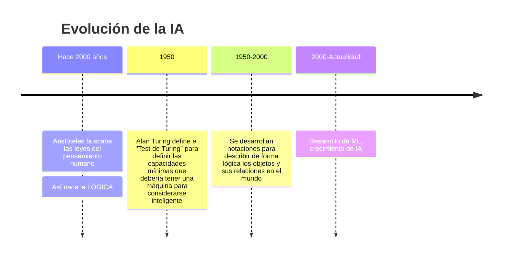
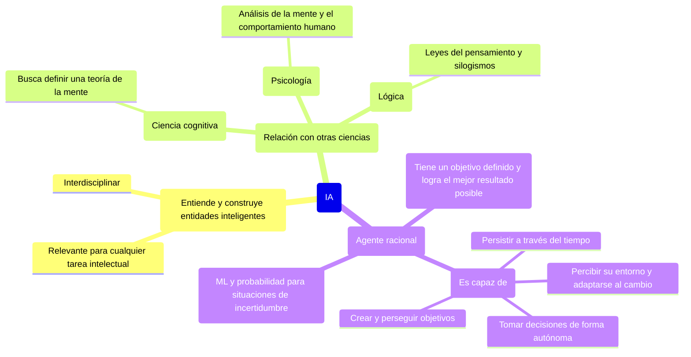

---
tags:
  - ai
  - aiama4
  - inteligencia
  - pensamiento
  - lectura
---
## Ideas

- El campo de la inteligencia artificial, se encarga no solamente de entender entidades inteligentes, sino de construirlas.
- Este campo ha generado un gran impacto en la humanidad debido a que es relevante casi que para cualquier campo, tiene una increíble variedad de subcampos, que parten desde lo general, como puede ser razonamiento, percepción, aprendizaje, hasta los temas más particulares, como jugar ajedrez, diagnosticar enfermedades, conducir un auto. Es **relevante para cualquier tarea intelectual**
- Existen varias definiciones acerca de la inteligencia:
	- Algunos la consideran en términos del rendimiento humano (¿quizás si una acción o pensamiento se acerca lo más parecido a lo que haría un ser humano?)
	- Otros, de forma más abstracta, como la *racionalidad*, como algo que se acerca a lo que *está bien*
	- Algunos la consideran como parte de un proceso interno de pensamiento
	- Otros como consideran el *comportamiento inteligente*, como una característica externa
- En 1950, Alan Turing propuso el ***test de Turing***, como una prueba que pondría a prueba la inteligencia de una máquina de tal forma que al interactuar con un humano real, este no pudiera discernir si es otro humano o es una máquina. Para lograr esto la máquina debería ser capaz de lo siguiente:
	- Procesar el lenguaje natural, así se podría comunicar de forma satisfactoria con humanos
	- Representación del lenguaje, para almacenar lo que sabe o escucha (quizás se refiere a la percepción del entorno)
	- Razonamiento automático, para responder preguntas y llegar a nuevas conclusiones
	- Aprendizaje automático, lo que le permite adaptarse a nuevas circunstancias y detectar o extrapolar patrones (machine learning)
- Otros investigadores han propuesto la **prueba total de Turing***, donde se tiene en consideración que para que una máquina pueda ser inteligente, esta debe poder interactuar con objetos físicos y con personas en el mundo real, a lo cuál añade:
	- Visión por computador
	- Reconocimiento del habla
	- Robótica
- Los investigadores consideran que es más importante comprender los principios detrás de lo que conocemos como inteligencia, en lugar de solamente intentar solucionar una prueba muy específica como lo puede ser el test de Turing. Poniendo como punto de comparación el momento en el que se logró desarrollar la aeronáutica, y es que esta empezó a tomar sentido y a funcionar en el momento que se empezó a entender los principios básicos detrás de la aerodinámica, en lugar de intentar replicar el comportamiento de las aves solo por el hecho de que ellas también vuelan.
### Ciencia cognitiva

- Para lograr que una máquina piense como un humano, primero es fundamental entender como piensan los humanos, según el texto hay 3 maneras para conocer como funciona el pensamiento humano:
	1. Introspección
	2. Experimentos psicológicos, observando a una persona en acción
	3. Imágenes cerebrales, observando directamente el cerebro
- Si esto da como resultado a una ***teoría de la mente***, podremos replicar el comportamiento desde una máquina, teniendo como evidencia el hecho de que las entradas y salidas de un programa que simule el comportamiento humano se parezcan a las de un humano real, se podría considerar que existe un programa que ha replicado el pensamiento humano.
- Aquí se menciona un campo interdisciplinario que se conoce como **cognitive science** o **ciencia cognitiva**, el cuál se encarga de enlazar modelos computacionales propuestos desde IA y técnicas experimentales desde la psicología para construir *teorías de la mente humana*, que sean testeables y precisas.
- La evidencia de la ciencia cognitiva se basa en la experimentación real con humanos o animales.
- Anteriormente, se pensaba que si un algoritmo era capaz de desarrollarse bien en una tarea, esto se entendería como un buen modelo del desempeño humano y viceversa. Es como, si de cierta manera, se correlacionara siempre los problemas resueltos desde modelos computacionales tuvieran siempre una forma de explicar el comportamiento humano. Sin embargo, en un enfoque más moderno, y es que se separan los enfoques tanto de ciencias cognitivas como de IA, de tal manera que esto ha permitido que cada campo avance de forma mucho más rápida. Un ejemplo de esto, es que en el campo de la neuroimagen, se ha combinado con algoritmos de machine learning para procesar estos datos y tener de alguna manera las bases para *leer mentes*. Esto como resultado de que quizás se usan algoritmos que permiten predecir las imágenes del cerebro que representan el comportamiento del pensamiento humano.

### Pensamiento racional. Enfoque: "leyes del pensamiento"

Es otro de los enfoques que se tienen para tratar de entender el pensamiento humano, es por eso, que históricamente se han buscado ¿*cuáles son las leyes del pensamiento racional*?

- Desde hace más de 2000 años, Aristóteles, fue uno de los precursores en buscar estas leyes del pensamiento humano. A través de algo que él denominó como el ***pensamiento correcto***, que como tal eran procesos de razonamiento que NO podrían ser refutados. Sus ***silogismos*** eran estructuras argumentales que siempre llevaban a las conclusiones correctas si se daban las premisas correctas. Es así como nació el campo conocido como ***la lógica***.
- A través del tiempo, los investigadores del campo de lógica han intentado desarrollar notaciones que describen los objetos en el mundo y las relaciones entre ellos.
- Como tal la lógica, para que funcione, necesita conocer que algo sea **VERDADERO*** o ***FALSO***, sin embargo esta condición se da rara vez en la realidad. Es por ello que de esta necesidad nace algo conocido como la ***TEORÍA DE LA PROBABILIDAD***, la cual busca llenar este vacío que plantea el campo de la lógica, ya que permite razonamiento riguroso con información *incierta*. Esta teoría permite construir un "*modelo comprensivo de pensamiento racional*", que permite llevar desde información perceptual plana un entendimiento de como funciona el mundo e inclusive realizar predicciones sobre el futuro. Sin embargo, no es capaz de generar ***comportamiento inteligente***.

### El enfoque del "agente racional"

- El término de ***agente*** se refiere a algo que actúa. Sin embargo, un agente computacional se espera que:
	- pueda ser capaz de percibir el entorno
	- tomar decisiones de forma autónoma
	- persistir sobre un periodo de tiempo prolongado
	- adaptarse al cambio
	- crear y perseguir objetivos
- Es de allí, que nace el concepto de ***agente racional***, que se define como un agente que actúa con la finalidad de ***lograr el mejor resultado posible***, incluso si hay incertidumbre.
- Este enfoque tiene unas ventajas sobre los otros enfoques:
	1. Principalmente, es **un enfoque más general***. Por ejemplo, si lo comparamos con el enfoque de las leyes del pensamiento, cuyo principal énfasis eran las *inferencias correctas*, esto es parte de un agente racional, puesto que, para actuar de forma racional es necesario realizar las inferencias correctas para lograr el mejor resultado. Es así que llegar a las *inferencias correctas* es solamente UNA de MUCHAS formas en las que se puede llegar a actuar de forma racional.
	2. El estándar de la racionalidad está matemáticamente bien definido y completamente generalizado, haciéndolo más ameno para el desarrollo científico.
- Inicialmente, los agentes racionales se construían en fundaciones de lógica en los cuales se definían planes muy definidos para lograr objetivos muy específicos.
- Luego, los agentes racionales evolucionaron gracias al uso de la ***teoría de la probabilidad*** y el ***machine learning***, ya que esto permitía a los agentes tomar decisiones bajo incertidumbre y sacar el mejor resultado esperado.
- Con esto, podemos definir que el campo de la inteligencia artificial se encarga de estudiar y construir agentes capaces de *actuar correctamente*. Estos actos correctos son definidos por el objetivo que es proporcionado hacia el agente.
- Este paradigma general es tan general que se conoce como el ***modelo estándar***. No solamente es usado en el campo de IA sino que también es aplicable en la teoría del control, investigación de operaciones, estadística e incluso economía.
- En ambientes complejos, no es posible llegar a una *racionalidad perfecta*. Esto se debe a limitaciones computacionales.

### Máquinas beneficiosas

- Hay un problema que surge desde el planteado **modelo estándar**, y es que, este modelo plantea que se le debe definir un objetivo muy específico al agente. Sin embargo, en el mundo real normalmente estos objetivos no se encuentran siempre definidos de forma tan específica, llevando a que el comportamiento de los agentes pueda llegar a ser inesperado.
- Esto plantea un problema que el autor denomina como el *value alignment problem*, que consiste en llegar a un acuerdo entre el objetivo que tiene el agente y el objetivo del humano. Los objetivos deberían estar alineados con los del ser humano.

---
## Resumen

### Evolución de la IA

Este diagrama representa una breve descripción de la evolución de la IA a través del tiempo como ciencia:

### Mapa conceptual

---
## Cuestionamientos

- ¿Qué definiciones existen sobre la *inteligencia*?
- ¿Teoría del control?
- ¿Cómo se puede entender el pensamiento humano?
- ¿Qué es el pensamiento humano?
- ¿Qué es el pensamiento racional?
- ¿Qué se puede definir como racional y qué es lo irracional?
- ¿Qué se considera comportamiento inteligente?
- En el texto se habla sobre el *modelo estándar*. ¿Qué es y por qué abarca tantos campos distintos a la IA?
- Se habla acerca de varios enfoques sobre la IA. ¿Qué otros enfoques más existen fuera de los que se narran en el texto?
- El enfoque de *agente racional*, ¿es el principal enfoque?
- También se narra acerca de que, *"hay muchas formas de llegar a un comportamiento racional, fuera de las inferencias correctas"*. ¿De qué otras maneras podemos llegar a este comportamiento racional?