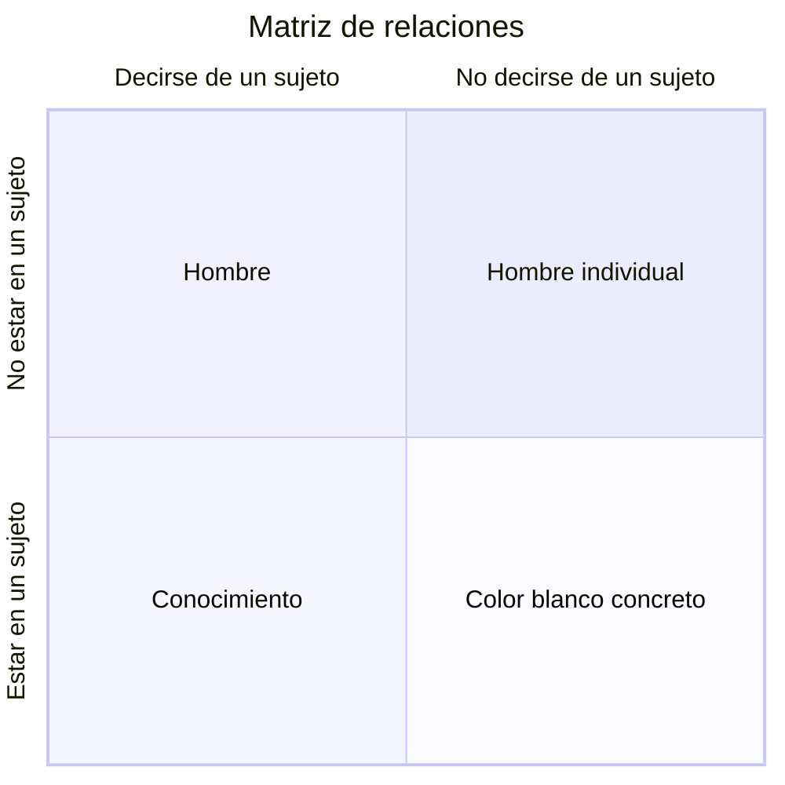

# Definición aristotélica

En su texto *Categorías*, Aristóteles plantea dos tipos de relaciones fundamentales que puede tener un ente con un sujeto: *decirse de un sujeto* y *estar en un sujeto*. 
## Decirse de un sujeto

Cuando un ente *se dice de un sujeto*, existe una predicación [[homonimia-sinonimia-paronimia#Sinonimia |sinónima]]: tanto el nombre como el enunciado del ente se predican del sujeto. Por lo tanto, cuando existe una relación de *decirse de un sujeto*, el ente expresa qué es ese sujeto.

>[!note] Sócrates es hombre
>Hombre se predica de Sócrates ya que se transmite tanto el nombre como el enunciado de *hombre* hacia el sujeto Sócrates. Por lo tanto, hombre se dice de Sócrates.
## Estar en un sujeto

Cuando un ente *está en un sujeto*, hay una relación donde el ente no es parte del sujeto y no puede existir independientemente de él. El nombre del ente se predica [[homonimia-sinonimia-paronimia#Paronimia|paronímicamente]], puesto que se transmite únicamente el nombre del ente, jamás el enunciado. Estar en un sujeto expresa algo del sujeto, pero nunca expresa qué es el sujeto.

>[!note] El color blanco concreto está en un caballo individual
>Un color blanco concreto se encuentra como una propiedad de un caballo en específico. Ese color blanco concreto no puede existir si ese caballo específicamente no existe.

>[!note] Sócrates es blanco
>Blanco se predica de Sócrates paronímicamente. Se transmite el nombre de blanco en la predicación, pero no el enunciado, ya que Sócrates en esencia no es blanco. Blancura se encuentra en Sócrates como una cualidad y se expresa acerca de él con la derivación morfológica *blanco* de *blancura*.

## Matriz de relaciones entre entes y sujetos

Las dos relaciones fundamentales que plantea Aristóteles en el texto de Categorías operan como ejes independientes que coexisten, lo que nos da como resultado una matriz con cuatro cuadrantes posibles:

Vamos a entrar en profundidad en cada uno de los cuadrantes:

### Decirse de un sujeto y no estar en un sujeto

En esta categoría se encontrarían aquellas cosas que solamente operan en el eje de *decirse del sujeto* pero que no están en ningún sujeto. La predicación de estas cosas siempre sería sinonímica y transmitirían el nombre y enunciado hacia el sujeto, pero jamás son algo de un sujeto. Siempre expresarán qué es el sujeto pero no algo que tiene el sujeto.

>[!note] Hombre
>Aristóteles define *hombre* como una especie que se dice de muchos sujetos. Sin embargo *hombre* no está en ningún sujeto. Sócrates es hombre, porque *hombre* define qué es Sócrates, pero hombre no está en Sócrates, no es algo que sea del sujeto.

### Decirse de un sujeto y estar en un sujeto

Las cosas categorizadas en este cuadrante operan de forma simultánea en los ejes *decirse de algo* y *estar en algo*, con distintos sujetos. Así como se transmiten el nombre y el enunciado sobre algunos sujetos, estas también pueden ser algo de otros sujetos.

>[!note] Conocimiento
>Aristóteles plantea el ejemplo con *conocimiento*, ya que conocimiento se dice de algunos sujetos, como en el caso: *saber leer y escribir es conocimiento*; este es un ejemplo donde "*saber leer y escribir*" actúa como un tipo de conocimiento y por lo tanto, saber leer y escribir es, en cuanto tal, conocimiento. También existe donde conocimiento *está en un sujeto*, como en el caso: *el conocimiento está en el alma*; aquí el alma no es conocimiento, pero sí está en ella como cualidad que no puede existir independientemente del sujeto.

### No decirse de un sujeto y estar en un sujeto

Las cosas categorizadas en este cuadrante nunca se predican de ellas de forma sinónima. Nunca expresan qué es el sujeto, expresan algo que está en el sujeto.

>[!note] Color blanco concreto
>Hablamos de color blanco concreto como una cualidad específica de un sujeto particular. Si se predica *el color blanco concreto está en el caballo*, Aristóteles plantearía que el color blanco en específico de ese caballo particular está en el sujeto y no existiría independientemente de él. Ese color blanco concreto no se dice de ningún sujeto.

### No decirse de un sujeto y no estar en un sujeto

Aristóteles clasifica en este cuadrante a las entidades primarias, los sujetos más particulares e individuales puesto que no se dicen de otros sujetos, ni tampoco se encuentran en ningún otro sujeto. No expresan el qué de otra cosa ni son algo de otra cosa.

>[!note] Hombre individual
>Aristóteles define al hombre individual como a un hombre en particular, una entidad primaria de la cual no derivan otros sujetos ni está en otro sujeto.