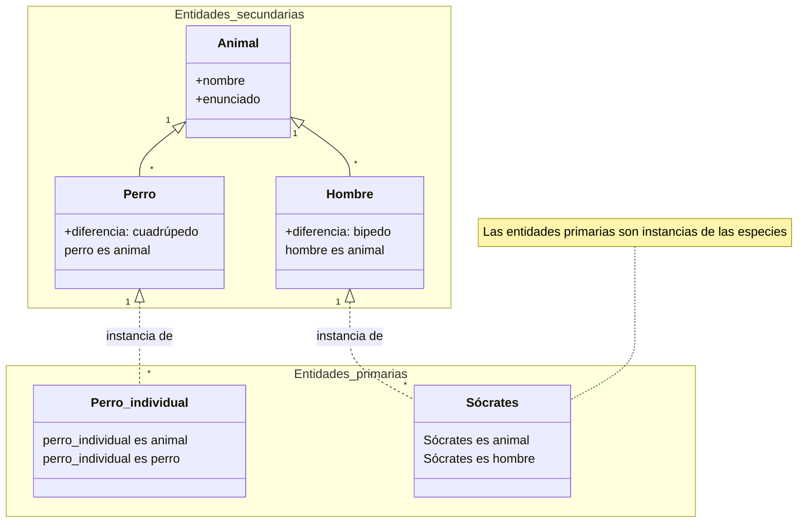

# Definición aristotélica

Aristóteles define la *entidad* como una de sus categorías. Está clasificada en *entidad primaria* y *entidad secundaria*.

## Propiedades generales de las entidades

Aristóteles plantea que todas las entidades primarias son iguales en cuanto a entidad, no hay un hombre individual que sea más entidad que un perro individual, o un animal que sea más entidad que otro. De las misma manera, no hay una especie que sea más entidad que otra especie o un género que sea más entidad que otro género.

Aristóteles plantea que la entidad no admite la propiedad de *más o menos* dentro de sus propios pares de especie o género. Es decir, un hombre no es más o menos hombre que otro de su misma especie y también en la relación consigo mismo, el hombre no es más o menos hombre antes que ahora.

Aristóteles plantea que las entidades no presentan ningún contrario, no existe un contrario a un perro, o ¿cómo puede existir algo contrario a un hombre?

## Entidad primaria

La entidad primaria es el sujeto que subyace a todas las demás cosas. No [[decirse-de-estar-en#No decirse de un sujeto y no estar en un sujeto|está en un sujeto ni se dice de un sujeto]]. Tomando esta premisa, para Aristóteles las entidades primarias son fundamentales para la existencia de todas las demás cosas, ya que todas las demás cosas se dicen de ellas o están en ellas. Sin ellas, no existiría nada más.

La entidad primaria es el sujeto último, el más particular, como cuando se refiere a Sócrates como un hombre individual.

## Entidad secundaria

La entidad secundaria es la que [[decirse-de-estar-en#Decirse de un sujeto|se dice]] de las [[entidad#Entidad primaria|entidades primarias]]. Aquí se definen todas aquellas entidades que Aristóteles plantea como *especie* o *género*, ya que establecen una jerarquía donde estas engloban a las demás entidades.

En esa jerarquía, Aristóteles establece que la *especie* es más entidad que el *género*. El argumento que utiliza el autor para plantear esta jerarquía es que aquello que es más entidad que otra da una definición más cognoscible acerca de *qué es el sujeto*. Por ejemplo, en la relación donde el género es animal, la especie es hombre y la entidad primaria es Sócrates, es más cognoscible el enunciado de *hombre* que de *animal*.

Teniendo esto en cuenta, la *entidad secundaria* Aristóteles la clasifica como aquella [[decirse-de-estar-en#Decirse de un sujeto y no estar en un sujeto|que se dice de un sujeto pero no está en un sujeto]]. Las entidades secundarias se dicen de las entidades primarias, y los géneros se dicen de las especies, pero ninguna está en algún sujeto.

Aristóteles aclara que es clave no confundir *la parte de un sujeto* con lo que [[decirse-de-estar-en#Estar en un sujeto|está en un sujeto]]. Puesto que lo que *está en un sujeto* no hace parte del sujeto como entidad, sino que es propiedad, define algo que tiene el sujeto. Lo que es parte del sujeto es constitutivo de la entidad.

## La entidad primaria como el *esto* y la contrariedad

El *esto*, Aristóteles lo define como lo individual y numéricamente uno. Es aquí, donde *el esto* parece ser la misma entidad primaria, que en griego se dice como "*tóde ti*", una forma de referirse a algo concreto y determinado, que es propio de la entidad.

Aristóteles plantea que la capacidad de admitir contrariedad dentro de sí mismo y seguir siendo individual y numéricamente uno es propio de la entidad primaria.

Esto ocurriría en casos como *el perro está corriendo* y *el perro está sentado*, en cuyo caso, el sujeto de cambio fue la entidad primaria "perro". Por lo tanto, esta propiedad Aristóteles describe que la capacidad de admitir contrariedad dentro de sí mismo está en virtud de su propio cambio.

>[!note] La aclaración respecto a enunciado y opinión
>Aristóteles plantea una posible tensión con la anterior afirmación, donde explica que aparentemente la capacidad de admitir contrariedad no podría ser única de la entidad primaria, sino que tambien se podría ver reflejada en un enunciado o en una opinión.
>Sin embargo, argumenta que esto no es así, puesto que un enunciado o una opinión posee un valor de verdad o falsedad respecto a la realidad a la que se refiere, pero no cambia en sí mismo.
>En el enunciado *el perro está corriendo*, cuando el perro deja de correr, el enunciado sigue siendo el mismo, solamente cambia su estado de validez, pero en la realidad el agente de cambio fue el perro, la *entidad primaria*.

